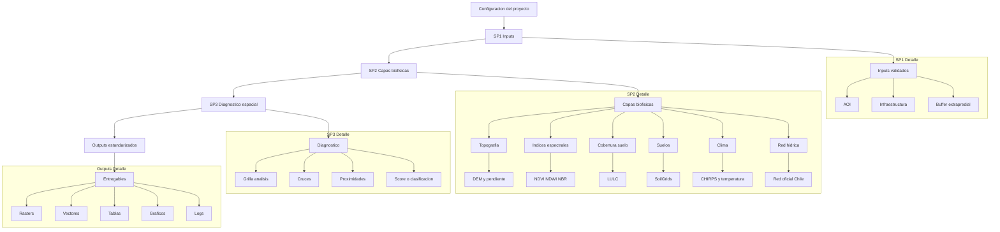

## diagnostico_biofisico

Motor automatizado de diagnostico biofisico basado en integracion de datos espaciales, climaticos y edaficos.

El sistema genera insumos cartograficos y metricos estandarizados para soporte tecnico y toma de decisiones.

---

## Objetivo del sistema

Automatizar la generacion de:

- Capas base: DEM, pendiente, indices espectrales y cobertura
- Contexto territorial: AOI, buffer y red hidrica oficial
- Suelos: variables minimas desde SoilGrids
- Clima: climatologia anual y series mensuales
- Diagnostico espacial integrado
- Outputs estandarizados reproducibles

---

## Arquitectura general

